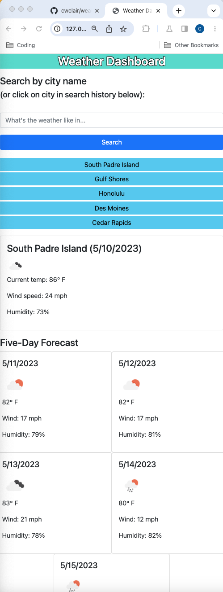

# weather-dashboard
A weather dashboard that shows current conditions and five days' worth of forecasted conditions.

## User Story

```
AS A traveler
I WANT to see the weather outlook for multiple cities
SO THAT I can plan a trip accordingly
```

## Acceptance Criteria

```
GIVEN a weather dashboard with form inputs
WHEN I search for a city
THEN I am presented with current and future conditions for that city and that city is added to the search history
WHEN I view current weather conditions for that city
THEN I am presented with the city name, the date, an icon representation of weather conditions, the temperature, the humidity, and the wind speed
WHEN I view future weather conditions for that city
THEN I am presented with a 5-day forecast that displays the date, an icon representation of weather conditions, the temperature, the wind speed, and the humidity
WHEN I click on a city in the search history
THEN I am again presented with current and future conditions for that city
```

## Description of the Work

The Weather Dashboard starts as a simple form, a place where the user can enter a city name. When a user enters a city name and uses the search button below, that city is added to a search history list below the search button, and current and five-day forecast conditions appear to the right of the search column (or underneath the search assets if viewed on a phone/small screen). 

The weather data is pulled from OpenWeatherMap via API calls. We capture the city name from the form, and plug that in to the search area of the API URL, along with the API key that I got from OpenWeatherMap. I also added "&units=imperial" to the search query in order to get figures in Fahrenheit/miles per hour. I discovered that if you did not specify, temperatures would be returned in Kelvin, which is not very helpful. Personally, I would prefer to use "&units=metric", as I prefer Celsius temps, but I realize that as someone living in the US, I should go with the system most used here. 

I also set a variable (cities) equal to readCitiesFromStorage function (more on that later), use unshift to add our new city into the front of the cities array, clear the search form, and run addCitiesToPage (again, more on that later).

I pulled from relevant endpoints such as temp, wind, humidity, etc. I used Math.floor to round down the temperature to the nearest integer, and went the other way, Math.ceil, for the wind speed.

I created an event listener to handle the gathering of the city name, along with the calling of functions that display the current and five-day conditions. My primary format of the data is tied to Bootstrap. I use dayjs() to create the date displays for both categories. I use a for loop to run through an array of extended days (in order to calculate the dates for those days) and a concurrent condition to pull the conditions 24, 48, 72, 96, and 120 hours from the current time ... hence the five-day forecast.

To get the five-day API call to work properly: After the fetch of the current conditions, I set variables for that city's latitude and longitude, and use those numbers in the five-day API URL, which I pull together and fetch immediately getting those numbers.

In terms of the search history feature...

On page load, I run a function called addCitiesToPage. This sets a variable (cities) equal to the function readCitiesFromStorage. That function sets a variable (cities) equal to the local storage key 'cities'. If this array exists, it's time to parse. If there is nothing in the local storage with the key 'cities,' cities is set to a blank array. 

Also within the addCitiesToPage function: the creation and appending of an unordered list element, followed by a for loop that creates and appends list items for each city in the array cities. 

I have a second event listener for the search history list, which does pretty much the same thing as the other event listener, except that it does not contain the code that adds the city to the search history ... because it's already in there.

At present time, I have applied minimal styles beyond the Bootstrap classes (pretty much just a color palette I pulled from Adobe), but the page layout does change based on screen size.

## Overview of the Site

Some screenshots below. One at narrow width to show the stacking. A couple at wider width. I have the Dev Tools open to show the array of cities in local storage at the time of the screenshots.



## Link to Deployed Site

https://cwclair.github.io/weather-dashboard

## Resources Used

Class lectures/activities, W3Schools tutorials, and a shout-out to teaching assistant Brian Baker, who met with me Monday 5/8 during office hours so I could run through my code with him and talk through what I intended my code to do as written. That conversation forced me to look at my code and better comprehend why the timing of my function calls was causing problems. As someone four weeks into using JavaScript and its functions, I felt like I needed someone to prod me with simple questions. I also note in my JS comments a couple of things that I found in specific places online (how to outline my heading text, for example).